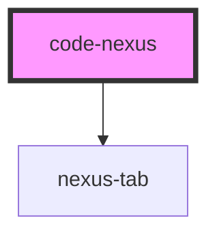

# code-nexus

<!-- Auto Generated Below -->

## Properties

| Property          | Attribute          | Description                                          | Type                                                                 | Default                         |
| ----------------- | ------------------ | ---------------------------------------------------- | -------------------------------------------------------------------- | ------------------------------- |
| `css`             | `css`              |                                                      | `string`                                                             | `'\n\n\n\n\n\n\n\n\n\n\n'`      |
| `debounceTime`    | `debounce-time`    | The length of time to debounce updates to the iframe | `number`                                                             | `300`                           |
| `enableTemplates` | `enable-templates` | Ability to load example/starter templates            | `boolean`                                                            | `false`                         |
| `hideEditors`     | `hide-editors`     | Hides the live editor containers                     | `boolean`                                                            | `false`                         |
| `html`            | `html`             |                                                      | `string`                                                             | `'\n\n\n\n\n\n\n\n\n\n\n'`      |
| `javascript`      | `javascript`       |                                                      | `string`                                                             | `'\n\n\n\n\n\n\n\n\n\n\n'`      |
| `tabbed`          | `tabbed`           | Switches from split view to a tabbed view            | `boolean`                                                            | `false`                         |
| `templates`       | --                 | Custom starter templates for quick loading           | `{ name: string; html: string; css: string; javascript: string; }[]` | `[]`                            |
| `theme`           | --                 |                                                      | `{ colors: Colors; dark: boolean; }`                                 | `{ colors: color, dark: true }` |

## Events

| Event           | Description                                   | Type                                                              |
| --------------- | --------------------------------------------- | ----------------------------------------------------------------- |
| `contentChange` | Event emitted when any editor content changes | `CustomEvent<{ html: string; css: string; javascript: string; }>` |

## Methods

### `loadTemplate(template: { html: string; css: string; javascript: string; }) => Promise<void>`

Load a template into the editor

#### Returns

Type: `Promise<void>`

## Dependencies

### Depends on

- [nexus-tab](../nexus-tabs)

### Graph

----------------------------------------------

*Built with [StencilJS](https://stenciljs.com/)*
