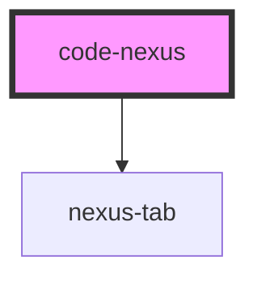

# code-nexus

<!-- Auto Generated Below -->

## Properties

| Property       | Attribute       | Description                                          | Type                                 | Default                         |
| -------------- | --------------- | ---------------------------------------------------- | ------------------------------------ | ------------------------------- |
| `css`          | `css`           |                                                      | `string`                             | `'\n\n\n\n\n\n\n\n\n\n\n'`      |
| `debounceTime` | `debounce-time` | The length of time to debounce updates to the iframe | `number`                             | `300`                           |
| `hideEditors`  | `hide-editors`  | Hides the live editor containers                     | `boolean`                            | `false`                         |
| `html`         | `html`          |                                                      | `string`                             | `'\n\n\n\n\n\n\n\n\n\n\n'`      |
| `javascript`   | `javascript`    |                                                      | `string`                             | `'\n\n\n\n\n\n\n\n\n\n\n'`      |
| `tabbed`       | `tabbed`        | Switches from split view to a tabbed view            | `boolean`                            | `false`                         |
| `theme`        | --              |                                                      | `{ colors: Colors; dark: boolean; }` | `{ colors: color, dark: true }` |

## Dependencies

### Depends on

- [nexus-tab](../nexus-tabs)

### Graph

----------------------------------------------

*Built with [StencilJS](https://stenciljs.com/)*
