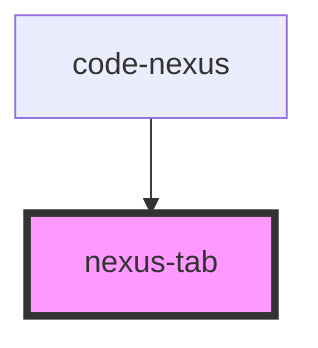

# nexus-tab

<!-- Auto Generated Below -->

## Properties

| Property   | Attribute  | Description                         | Type      | Default     |
| ---------- | ---------- | ----------------------------------- | --------- | ----------- |
| `active`   | `active`   |                                     | `boolean` | `false`     |
| `disabled` | `disabled` | Whether the tab is disabled         | `boolean` | `false`     |
| `icon`     | `icon`     | Optional icon to display in the tab | `string`  | `undefined` |
| `onDark`   | `on-dark`  |                                     | `boolean` | `false`     |
| `tooltip`  | `tooltip`  | Tooltip text for the tab            | `string`  | `undefined` |

## Dependencies

### Used by

 - [code-nexus](../code-nexus)

### Graph

----------------------------------------------

*Built with [StencilJS](https://stenciljs.com/)*
